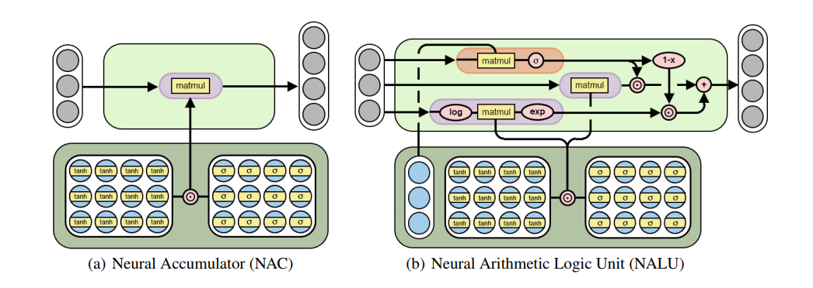

# Neural Arithmetic Logic Units (NALU)




Basic pytorch implementation of NAC/NALU from [Neural Arithmetic Logic Units](https://arxiv.org/pdf/1808.00508.pdf) by trask et.al

## Installation

```python
pip install NALU
```

## Usage

```python
from nalu.core import NaluCell, NacCell
from nalu.layers import NaluLayer
```
